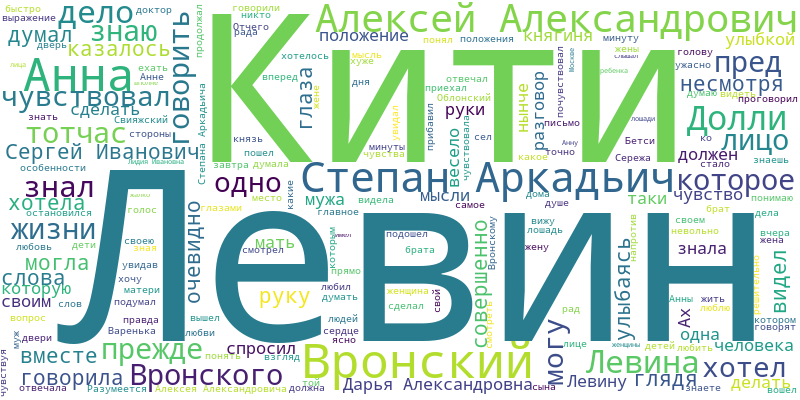

# Анна Каренина

Начнем с "Анны Карениной" Льва Толстого.

## Общая информация

|Параграфы|Предложения  |Слова |Уникальные слова|Символы без пробелов|Всего символов|
|---------|-------------|------|----------------|--------------------|--------------|
|7803     |20861        |344995|35637           |1439992             |1775441       |

Диалоги составляют 36,51% текста. В тексте использовано больше 35000 (!) уникальных слов.

## Предложения

| Предложения | Максимум | Среднее           | Медиана | Мода | 
|-------------|----------|-------------------|---------|------| 
| 20861       | 154      | 13.01 | 10      | 4    | 

Самое длинное предложение в романе выглядит так:

> Теперь Алексей Александрович намерен был требовать: во-первых, чтобы составлена была новая комиссия, которой поручено бы было исследовать на месте состояние инородцев; во-вторых, если окажется, что положение инородцев действительно таково, каким оно является из имеющихся в руках комитета официальных данных, то чтобы была назначена еще другая, новая ученая комиссия для исследования причин этого безотрадного положения инородцев с точек зрения: а) политической, б) административной, в) экономической, г) этнографической, д) материальной и е) религиозной; в-третьих, чтобы были затребованы от враждебного министерства сведения о тех мерах, которые были в последнее десятилетие приняты этим министерством для предотвращения тех невыгодных условий, в которых ныне находятся инородцы, и, в-четвертых, наконец, чтобы было потребовано от министерства объяснение о том, почему оно, как видно из доставленных в комитет сведений за NN 17015 и 18308, от 5 декабря 1863 года и 7 июня 1864, действовало прямо противоположно смыслу коренного и органического закона, т..., ст. 18, и примечание к статье 36.

Жуть, да и только.

## Части речи

|Часть речи|Количество|Процент             |
|----------|----------|--------------------|
|существительное|55284     |42.179   |
|глагол    |45636     |34.818   |
|прилагательное|20182     |15.398   |
|наречие   |6851      |5.227   |
|NONLEX    |1250      |0.954  |
|предикатив|668       |0.510  |
|предлог   |663       |0.506  |
|числительное|212       |0.162 |
|частица   |204       |0.156  |
|междометие|70        |0.053 |
|числительное-прилагательное|24        |0.018|
|союз      |13        |0.010|
|вводное слово|13        |0.010|

Из существительных, глаголов и прилагательных можно составить почти любой текст.

## Настроение

Для оценки настроения использовался модуль с оригинальным названием dostoevsky. Негатива в книге больше, чем позитива примерно в полтора раза. Классика, что поделать.

|Настроение|Процент|
|----------|-------|
|neutral   |52.1|
|negative  |18.2|
|skip      |17.0|
|positive  |11.6|
|speech    |1.1|

## Топ-слова

|Слово  |Количество|
|-------|----------|
|свой   |1814      |
|левин  |1639      |
|говорить|1254      |
|знать  |1114      |
|вронский|864       |
|анна   |817       |
|рука   |713       |
|понимать|703       |
|кити   |660       |
|видеть |655       |
|думать |644       |
|алексей|635       |
|лицо   |605       |
|александрович|578       |
|степан |551       |
|аркадьич|550       |
|дело   |527       |
|ничто  |506       |
|чувствовать|479       |
|глаз   |473       |

Левин встечается в романе в два раза чаще, чем Анна. И вы еще спрашиваеете, кто здесь главный герой?

Еще из интересного можно заметить, что Степан без Аркадьича встречается всего 1 раз.

Топ лемм (нормальных форм слов) выглядит так:

### Самые популярные пары слов

|Слово 1|Слово 2      |
|-------|-------------|
|степан |аркадьич     |
|алексей|александрович|
|сергей |иванович     |
|дарья  |александровна|
|лидия  |ивановна     |
|агафья |михайловна   |
|графиня|лидия        |
|анна   |аркадьевна   |
|марья  |николаевна   |
|друг   |друг         |

Тут ничего выдающегося, имена героев и разные формы "друг друга".

# Преступление и наказание

Продолжим разбираться с классикой. "Преступление и наказание"

## Общая информация

| Параграфы | Предложения | Слова  | Уникальные слова | Символы без пробелов | Всего символов | 
|-----------|-------------|--------|------------------|----------------------|----------------| 
| 4040      | 14161       | 230574 | 30482            | 961825               | 1136424        | 

Здесь диалогов больше, аж 51,95%. А вот уникальных слов чуть меньше. Также интересно, что длина текста меньше Карениной в полтора раза, а абзацев меньше в два.

## Предложения

| Предложения | Максимум | Среднее            | Медиана | Мода | 
|-------------|----------|--------------------|---------|------| 
| 14161       | 198      | 12.84 | 9       | 3    | 

Средняя длина предложения почти такая же, как у "Карениной", а медиана и мода поменьше.

Самое длинное предложение в романе выглядит так:

> Но ведь вот что при этом, добрейший Родион Романович, наблюдать следует: ведь общего-то случая-с, того самого, на который все юридические формы и правила примерены и с которого они рассчитаны и в книжки записаны, вовсе не существует-с по тому самому, что всякое дело, всякое, хоть, например, преступление, как только оно случится в действительности, тотчас же и обращается в совершенно частный случай-с; да иногда ведь в какой: так-таки ни на что прежнее не похожий-с. Прекомические иногда случаи случаются в этом роде-с. Да оставь я иного-то господина совсем одного: не бери я его и не беспокой, но чтоб знал он каждый час и каждую минуту, или по крайней мере подозревал, что я всё знаю, всю подноготную, и денно и нощно слежу за ним, неусыпно его сторожу, и будь он у меня сознательно под вечным подозрением и страхом, так ведь, ей-богу, закружится, право-с, сам придет да, пожалуй, еще и наделает чего-нибудь, что уже на дважды два походить будет, так сказать, математический вид будет иметь, — оно и приятно-с. Это и с мужиком сиволапым может произойти, а уж с нашим братом, современно умным человеком, да еще в известную сторону развитым, и подавно!

Тут мы наблюдаем, что модель разбиения на предложения, увы, несовершенна, и посчитала несколько предложений за одно. Пришлось отпралять сообщение о баге в NLTK.

## Части речи

| Часть речи                  | Количество | Процент              | 
|-----------------------------|------------|----------------------| 
| существительное             | 34774      | 41.40    | 
| глагол                      | 29691      | 35.35    | 
| прилагательное              | 11307      | 13.46   | 
| наречие                     | 5537       | 6.59    | 
| числительное                | 797        | 0.95   | 
| предикатив                  | 444        | 0.53   | 
| предлог                     | 434        | 0.52   | 
| NONLEX                      | 378        | 0.45   | 
| частица                     | 358        | 0.43   | 
| междометие                  | 107        | 0.13  | 
| союз                        | 95         | 0.11  | 
| вводное слово               | 67         | 0.08  | 
| числительное-прилагательное | 9          | 0.01 | 

Каких-то кардинальных отличий от Льва Толстого нет.

## Настроение

| Настроение | Процент              | 
|------------|----------------------| 
| neutral    | 47.76  | 
| skip       | 24.85  | 
| negative   | 18.09  | 
| positive   | 9.21  | 
| speech     | 1.08 | 

Соотношение между негативом и позитивом еще немного выросло.

## Топ-слова

| Слово        | Количество | 
|--------------|------------| 
| свой         | 687        | 
| раскольников | 640        | 
| знать        | 632        | 
| говорить     | 545        | 
| становиться  | 482        | 
| соня         | 382        | 
| самый        | 378        | 
| рука         | 377        | 
| дело         | 372        | 
| разумихин    | 351        | 
| ивановна     | 314        | 
| петрович     | 293        | 
| минута       | 278        | 
| видеть       | 278        | 
| пойти        | 276        | 
| понимать     | 275        | 
| ничто        | 269        | 
| слово        | 265        | 
| смотреть     | 262        | 
| выходить     | 257        | 

Топ нормальных форм:

### Самые популярные пары слов

| Слово 1   | Слово 2       | 
|-----------|---------------| 
| катерина  | ивановна      | 
| петр      | петрович      | 
| пульхерия | александровна | 
| авдотья   | романовна     | 
| марфа     | петровна      | 
| софья     | семеновна     | 
| крайний   | мера          | 
| родион    | романыч       | 
| андрей    | семенович     | 
| порфирий  | петрович      | 

Крайняя мера идеально затесалась в перечень героев.

# Обитаемый остров

Более современное произведение. "Обитаемый остров" братьев Стругацких.

## Общая информация

| Параграфы | Предложения | Слова  | Уникальные слова | Символы без пробелов | Всего символов | 
|-----------|-------------|--------|------------------|----------------------|----------------| 
| 2459      | 8024        | 113363 | 22431            | 497973               | 584679         | 

Диалогов здесь меньше - 29,5%. Да и само произведение существенно короче.

## Предложения

| Предложения | Максимум | Среднее            | Медиана | Мода | 
|-------------|----------|--------------------|---------|------| 
| 8024        | 177      | 11.075 | 7.0     | 4    | 

Средняя длина предложения и имедиана длины меньше, чем у более классических авторов.

Самое длинное предложение:

> И как несколько дней назад, снова пришлось ждать, пока пишутся какие-то бумаги, пока смешной человечек в нелепом головном уборе царапает что-то на розовых картонках, а красноглазый незнакомец царапает что-то на зеленых, а девица с оптическими усилителями на глазах делает на этих картонках фигурные вырезы, а потом все меняются картонками, причем запутываются, и кричат друг на друга, и хватаются за телефонный аппарат, и наконец человечек в нелепом головном уборе забирает себе две зеленые и одну розовую картонку, причем розовую картонку он рвет пополам и половину отдает девице, делающей вырезы, а шелушащийся незнакомец получает две розовые картонки, синюю толстую картонку и еще круглый металлический жетон с выбитой на нем надписью и все это минуту спустя отдает рослому человеку со светлыми пуговицами, стоящему у выходной двери, в двадцати шагах от человечка в нелепом головном уборе, когда они уже выходят на улицу, рослый вдруг принимается сипло кричать, и красноглазый незнакомец снова возвращается, и выясняется, что он забыл забрать себе синий картонный квадратик, и он забирает себе синий картонный квадратик и с глубоким вздохом запихивает куда-то за пазуху.

## Части речи

| Часть речи                  | Количество | Процент              | 
|-----------------------------|------------|----------------------| 
| существительное             | 20958      | 43.57    | 
| глагол                      | 16373      | 34.04    | 
| прилагательное              | 7028       | 14.61   | 
| наречие                     | 2772       | 5.76    | 
| предикатив                  | 280        | 0.58   | 
| предлог                     | 212        | 0.44  | 
| числительное                | 184        | 0.38  | 
| частица                     | 130        | 0.27   | 
| союз                        | 96         | 0.20   | 
| междометие                  | 33         | 0.07  | 
| вводное слово               | 14         | 0.03 | 
| числительное-прилагательное | 9          | 0.02  | 
| NONLEX                      | 8          | 0.02   | 

Соотношение между частями речи приблизительно такое же, как и у двух других авторов.

## Настроение

| Настроение | Процент              | 
|------------|----------------------| 
| neutral    | 46.93   | 
| skip       | 28.11  | 
| negative   | 17.45   | 
| positive   | 6.68  | 
| speech     | 0.82 | 

Из трех разобранных произведений "Обитаемый остров" содержит больше всего негативно окрашенных слов. Массаракш!

## Топ-слова

| Слово       | Количество | 
|-------------|------------| 
| максим      | 998        | 
| гай         | 494        | 
| мак         | 303        | 
| знать       | 255        | 
| рука        | 245        | 
| свой        | 244        | 
| зеф         | 241        | 
| ротмистр    | 239        | 
| господин    | 218        | 
| понимать    | 209        | 
| глаз        | 172        | 
| ничто       | 170        | 
| голова      | 163        | 
| говорить    | 157        | 
| массаракша  | 147        | 
| спрашивать  | 143        | 
| становиться | 141        | 
| лицо        | 140        | 
| дело        | 138        | 
| странник    | 127        | 

Радует, что в топ попал массаракш, который вполене ожидаемо был некорректно приведен к нормальной форме. Массаракш!

### Самые популярные пары слов

| Слово 1         | Слово 2  | 
|-----------------|----------| 
| господин        | ротмистр | 
| принц           | герцог   | 
| огненосный      | творец   | 
| ротмистр        | чача     | 
| обитаемый       | остров   | 
| друг            | друг     | 
| штаб            | врач     | 
| всякий          | случай   | 
| действительный  | рядовой  | 
| государственный | прокурор | 

Имен нет, у Стругацких более популярны должности, название романа и всякий случай.
